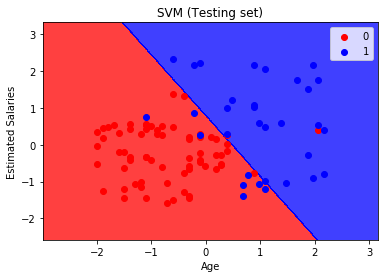

# Support_Vector_Machine_for_Classification
SVM algorithm in Python with classification

# Project Goal

The goal of this project is to predict whether the customer will purchase a car(1) or not(0).\
The dataset consists of 5 columns User ID, Gender, Age, Estimated Salary, Purchased(1 if purchased else 0)\
Here the features responsible to predict purchaser is Age and Estimated Salary as User ID and Gender have no impact on the prediction.

# Project Objectives

1. Understanding the Goal of project
2. Importing the required libraries and the dataset
3. Splitting the dataset (Train and Test sets)
4. Feature Scaling for normalization (Using linear SVC)
5. Fitting the SVM classifier model
6. Making predictions
7. Generating the Confusion Matrix
8. Visualizing the results (Train and Test sets)

# Result obesrved from the project:
1. SVM prediciton on Training set\

2. SVM prediciton on Testing set\

